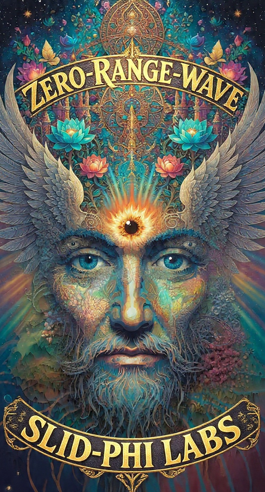

# shard-zip (public stub)


<p align="center">
  
</p>

<p align="center"><strong>Slid Phi Labs</strong> — official product branding</p>

<p align="center"></p>


**Proprietary.** Public npm does **not** include codec source.

## Get the real package

1. [Try Gate](https://www.slidphilabs.com/try) or purchase
2. [Access instructions](https://www.slidphilabs.com/access)

© Slid Phi Labs · All rights reserved

## Agentic commerce

Agents can buy / quote lab products via **x402** (USDC on Solana mainnet or Base mainnet).

```
Agent commerce: GET https://www.slidphilabs.com/api/agent then pay via x402 on Solana or Base mainnet (X-PAYMENT) on catalog POST.
```

| Surface | URL |
|---------|-----|
| Discovery | https://www.slidphilabs.com/api/agent |
| Catalog | https://www.slidphilabs.com/api/x402-products |
| agents.txt | https://www.slidphilabs.com/agents.txt |
| agents.json | https://www.slidphilabs.com/agents.json |
| llms.txt | https://www.slidphilabs.com/llms.txt |

Humans: [www.slidphilabs.com](https://www.slidphilabs.com) (Stripe).
